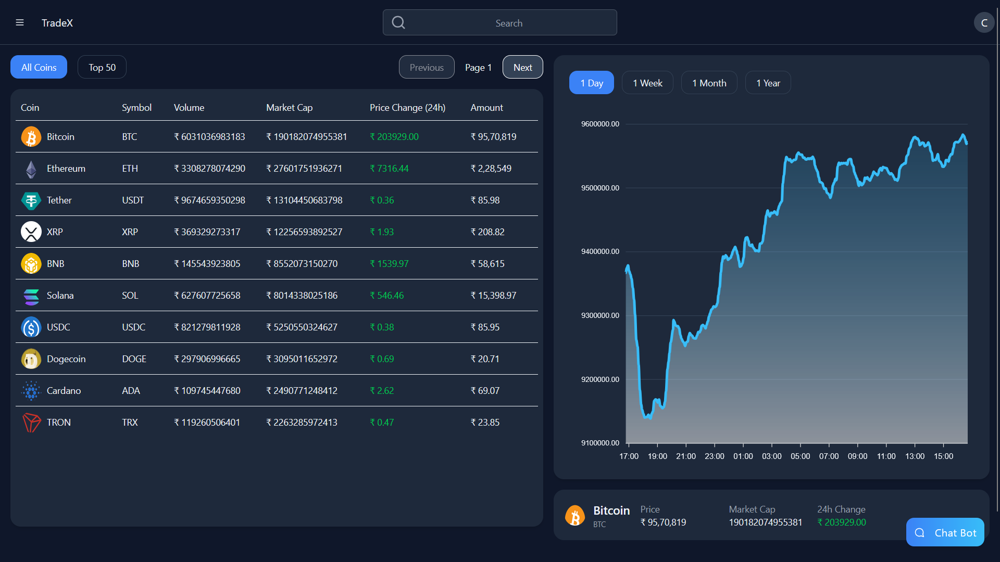

# 🚀 TradeX - Crypto Trading Platform

A full-stack, real-time crypto trading platform built with **Spring Boot (Backend)** and **React + TailwindCSS (Frontend)**. Designed to simulate the functionality of professional trading platforms with integrated wallet management, real-time coin data, 2FA, and secure payment handling using **Stripe**.


## 🔗 Live Demo

Check out the live app here: [TradeX](https://trading-project-1001-ffdf1.web.app/)

---

## 📌 Features

- 🔐 **User Authentication (JWT)**
- 💸 **Wallet Integration** – deposit, withdraw, and real-time balance
- 📈 **Live Crypto Data** – powered by CoinGecko API
- 📊 **Real-Time Price Graphs**
- 📥 **Buy/Sell Orders Simulation**
- 💳 **Stripe Integration** – supports international payments
- 🛡️ **Two-Factor Authentication (2FA)**
- 🧠 **Chatbot with Gemini AI Integration**

---

## 🧱 Tech Stack

| Layer        | Tech                                                         |
|--------------|--------------------------------------------------------------|
| **Frontend** | React, TailwindCSS, Redux Toolkit, Axios                     |
| **Backend**  | Spring Boot, Spring Security, JWT Auth                       |
| **Database** | MySQL                                                        |
| **APIs**     | CoinGecko (Crypto Data), Gemini AI (Chatbot)                 |
| **Payments** | Stripe (Single solution for both domestic and international) |
| **Cloud**    | GCP (Cloud Run for backend), Firebase (hosting frontend)     |

---

## 🚀 Getting Started (Locally)

## 🔐 `application.properties` Setup

To run the backend successfully, you’ll need to create an `application.properties` file inside `src/main/resources/`. Here's what to include:

```properties
# Database
spring.datasource.url=jdbc:mysql://localhost:3306/tradex
spring.datasource.username=your_db_username
spring.datasource.password=your_db_password

# JPA
spring.jpa.hibernate.ddl-auto=update

# JWT
jwt.secret=your_jwt_secret

# Stripe
stripe.secret.key=your_stripe_secret_key

# CoinGecko API (if needed)
coingecko.api.url=https://api.coingecko.com/api/v3

# Gemini AI (Optional if integrated)
gemini.api.key=your_gemini_api_key
```

---
## 🔐 How to Get API Keys

To run this project locally or deploy it yourself, you'll need the following keys and services:

- **Stripe API Key**  
  Get your key from the Stripe Dashboard: [https://dashboard.stripe.com/apikeys](https://dashboard.stripe.com/apikeys)

- **CoinGecko API**  
  No API key required. This is a public API, but it has rate limits.  
  Documentation: [https://www.coingecko.com/en/api](https://www.coingecko.com/en/api)

- **Gemini AI Key**  
  Used for the AI-powered chatbot feature. You can get access here: [https://aistudio.google.com/apikey](https://aistudio.google.com/apikey)

- **MySQL Database**  
  You can either:
    - Run a local MySQL instance, or
    - Use **Google Cloud SQL** for cloud-based hosting

---

## 🧪 Testing

- ✅ JUnit + Mockito for backend logic
- ✅ Manual API testing via Postman
- ✅ Frontend tested on Chrome, Edge, Firefox

---

## 💡 Why I Built This

I wanted to build something that reflects my backend expertise, is deployable, integrates secure payments, and simulates a real-world product. TradeX was created to challenge myself and showcase what I can build as a full-stack developer — all features from scratch and deployed on scalable cloud services.

---

## 🛠️ Future Improvements

- WebSocket-based live trading updates
- User order history and trade analytics
- Deploy Gemini-powered chatbot globally
- Advanced charting using D3.js or Recharts

---

## ⚙️ Environment Variables

> `application.properties` is excluded from version control

---
## 🔐 Admin Access

- Create a user with ROLE_ADMIN, and use those credentials to access Admin Dashboard